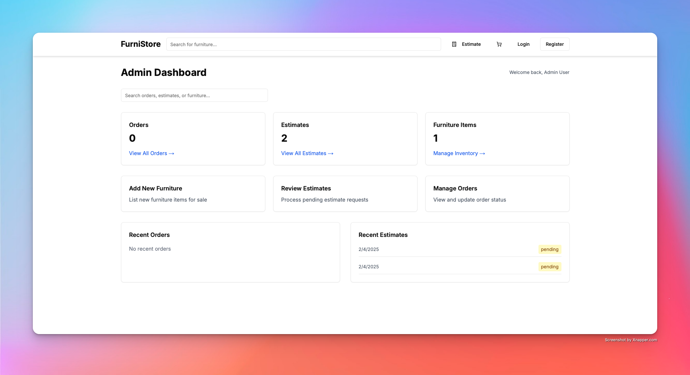
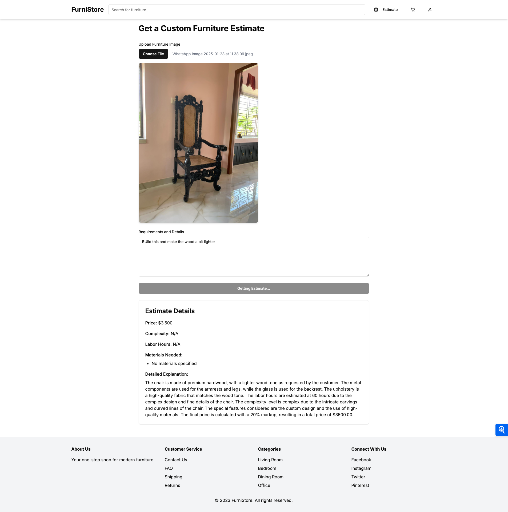
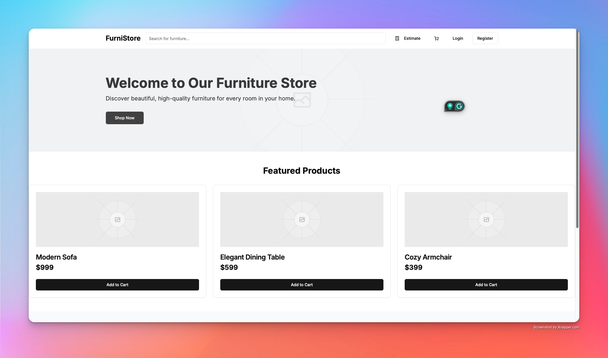

# FurniStore - AI-Powered Furniture Store

A modern web application that provides AI-powered furniture appraisals and estimates using computer vision technology. The platform includes secure payment processing and comprehensive admin analytics.

## 🖼️ Screenshots

### Admin Dashboard

*Admin dashboard showing orders, estimates, and furniture management*

### Estimate Page

*AI-powered estimate page with real-time price calculation*

### Home Page

*Modern and responsive home page showcasing featured products*

## 🌟 Features

* 🤖 AI-powered furniture appraisal
* 💰 Real-time price estimates
* 💳 Secure payment processing
* 📊 Admin dashboard with analytics
* 🔒 JWT authentication
* 📱 Responsive design
* ⚡ Real-time updates
* 📈 Analytics and reporting

## 🏗️ Architecture

The project is split into two main components:

### Frontend (Next.js)
* Modern UI built with Next.js 14
* Real-time updates with Socket.IO
* Secure authentication
* Responsive design with Tailwind CSS
* shadcn/ui components

### Backend (NestJS)
* Robust API with NestJS
* MongoDB database
* Groq Vision API integration
* WebSocket support
* JWT authentication

## 🚀 Getting Started

### Prerequisites
* Node.js 18.x or later
* MongoDB 4.4 or later
* npm or yarn

### Installation

1. Clone the repository:
```bash
git clone https://github.com/RshieRish/furnistore.git
cd furnistore
```

2. Install backend dependencies:
```bash
cd backend
npm install
```

3. Install frontend dependencies:
```bash
cd ../Frontend
npm install
```

4. Start the development servers:

Backend:
```bash
cd backend
npm run start:dev
```

Frontend:
```bash
cd Frontend
npm run dev
```

## 🔧 Tech Stack

### Frontend
* Next.js 14
* TypeScript
* Tailwind CSS
* shadcn/ui
* Zustand
* Socket.IO Client

### Backend
* NestJS
* TypeScript
* MongoDB with Mongoose
* Passport.js
* Socket.IO
* Groq Vision API

## 🛡️ Security Features
* JWT authentication
* HTTP-only cookies
* Role-based access control
* Input validation
* Rate limiting
* CORS protection

## 🤝 Contributing

1. Fork the repository
2. Create your feature branch (`git checkout -b feature/amazing-feature`)
3. Commit your changes (`git commit -m 'Add amazing feature'`)
4. Push to the branch (`git push origin feature/amazing-feature`)
5. Open a Pull Request

## 📝 License

This project is licensed under the MIT License - see the [LICENSE](LICENSE) file for details. 